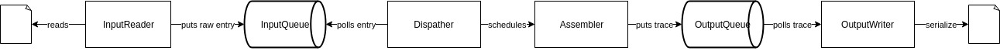

# backend-case-exercise
Run with: 

```$xslt
mvn clean install
java -jar target/backend-case-exercise-1.0-jar-with-dependencies.jar
java -jar target/backend-case-exercise-1.0-jar-with-dependencies.jar -i ./examples/small-log.txt -o traces.txt
```

In pom Java 10 is set as source and target, however project will also run and compile with java 9 and 8.

Change this properties in pom.xml
```$xslt
        <maven.compiler.source>1.10</maven.compiler.source>
        <maven.compiler.target>1.10</maven.compiler.target>
```
To appropriate version if java 10 is not available.

##Overview

Application consist four main parts:
* `InputReader` - File or stdin
* `Dispatcher` - Responsible for transforming raw strings into domain object as well as detecting orphans (some of them)
* `Assembler` - Receives finished traces, assemble them to correct hierarchy and puts request to serialize it
* `OutputWriter` - Serialize trace from objects to json (file or stdout)

Beside that `StatisticsHolder` and few `StatisticsCalculators` are responsible for gathering and calculating statistics about application.  

Simplified diagram:
